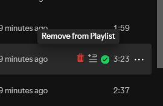

# Quick Remove from playlist

Adds a quick-remove button to your track rows. Lets you remove songs from your playlists in one click. You don't have to go through the drop down menu repeatedly.



## Installation

Manual Install
1. Download `remove-from-playlist.js`.
2. Place it inside your Spicetify `Extensions` folder.
3. Run the following commands in your terminal:
   ```bash
   spicetify config extensions remove-from-playlist.js
   spicetify apply
   ```
